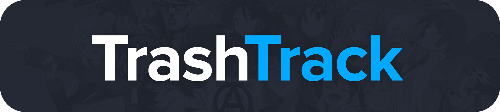

**Table of Contents**

- [Mock](#mock)
- [Resources](#resources)
- [Third-Party Libraries/APIs](#third-party-librariesapis)

# Mock

# Resources

-   [AniList API Documentation](https://anilist.gitbook.io/anilist-apiv2-docs)

# Third-Party Libraries/APIs

-   [AniList API v2](https://github.com/AniList/ApiV2-GraphQL-Docs)
